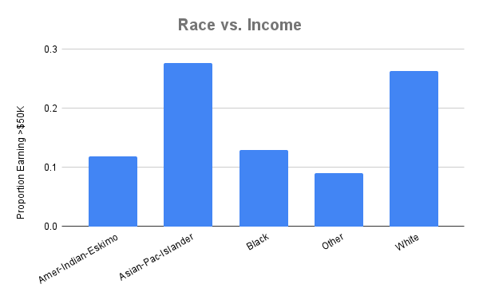
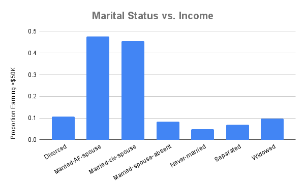
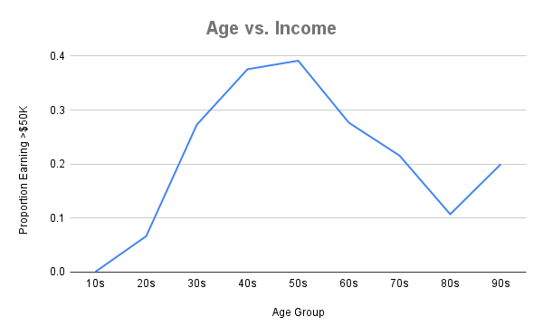

# Adult Income Analysis Practice

This project explores a sample of U.S. Census data from 1994 to uncover patterns and relationships related to adult income. The dataset includes demographic and employment-related variables, allowing for both descriptive and inferential analysis.

The goal of this analysis is:

- To practice fundamental data analytics techniques including data cleaning, exploratory data analysis (EDA), and visualization — all performed in Google Sheets.

- To apply inferential statistics to draw conclusions about the broader U.S. working adult population, using confidence intervals and hypothesis testing.

This project is part of my learning journey through the [DeepLearning.AI Data Analytics Professional Certificate](https://www.deeplearning.ai/courses/data-analytics/), and serves as an independent initiative to consolidate my knowladge.

## Data Cleaning

The original dataset includes 32,561 observations (rows) with 15 features (columns) related to demographic and employment data.

In order to simplify analysis, I performed the following cleaning steps:

- Removed rows with missing values (marked as `?`) in the `workclass`, `occupation`, and `native-country` columns. To do this, I:
  - Created a helper column with the formula `=IF(OR(B2="?", G2="?", N2="?"), "remove", "keep")`, which flagged rows with missing data in any of the three columns
  - Applied a filter to the helper column to select the rows marked as `removed`, and delted these rows
  - This step reduced the dataset from 32,561 rows to 30,162 clean rows

- Dropped the fnlwgt column, as it was a sampling weight not required for this analysis.
  
- To simplify income-related analysis and enable proportion and mean comparisons, I created a new column called `income_binary`.
  - I used the formula `=IF(N2=">50K", 1, 0)` which assigns `1` to individuals earning more than $50k and `0` to individuals earning /$50k or less

## Exploratory Data Analysis - Demographics and Income 

I first analyzed the data to uncover patterns and relationships between demographic variables and income level. 
These findings reflect the social, economic, and labor conditions of the early 1990s. While many of the structural patterns remain relevant today, they must be interpreted with care and not assumed to represent current realities.

The target variable used for these analyses was `income_binary` described above.
Proportions were calculated using pivot tables that grouped categorical variables and averaged the `income_binary` values. Since this variable is binary, the mean directly represents the percentage of individuals in each group who earn over /$50K.

### Income by Sex

- **31.38% of men** earned over \$50K  
- **Only 11.37% of women** did

This stark difference reflects the persistent gender income gap, which was even more pronounced in the 1990s than it is today. Several factors likely contributed — including occupational segregation, unequal access to leadership roles, and differing expectations or pressures related to work and caregiving.

In 1994, women were entering the workforce in growing numbers but remained concentrated in lower-paying roles and industries. 

### Income by Race

| Race                   | % Earning >\$50K |
|------------------------|------------------|
| Asian-Pac-Islander     | 27.71%           |
| White                  | 26.37%           |
| Black                  | 12.99%           |
| Amer-Indian-Eskimo     | 11.89%           |
| Other                  | 9.09%            |

Income disparities were present across racial groups. Asian-Pacific Islanders had the highest proportion of high earners, possibly reflecting skilled migration patterns or a concentration in technical or medical fields. White individuals also had above-average income rates. Meanwhile, Black and Indigenous individuals were significantly less likely to earn over \$50K — likely a reflection of long-term systemic inequality, discriminatory hiring practices, and historical underinvestment in education and job access.

### Income by Marital Status

Income varied significantly by marital status:

- **Married** individuals had the highest proportion of high earners at **47.62%** and **45.50%**
- **Never-married** individuals had the lowest, at just **4.83%**
- Divorced, separated, and widowed individuals all hovered around single digits

Married individuals were far more likely to earn over \$50K than any other group. This difference is likely influenced by age (married people tend to be older and more experienced), career stability, and perhaps dual-income household dynamics. 
Additionally, cultural and economic expectations may have pushed married individuals — particularly men — toward higher-paying, traditional full-time roles.

### Income by Age Group

To study how income varied across life stages, a new column `age_group` was created by grouping ages into 10-year bands (e.g., 20s, 30s, etc.). This was done using the formula: `=TEXT(INT(A2/10)*10, "00") & "s"`

We can see earnings increase with age and experience, and then decline as retirement approaches and people transition out of full-time work (and wealthier individuals potentially do so sooner). 
In 1994, career paths were often more linear than today, and pensions or fixed retirement ages may have played a stronger role in shaping this curve.

